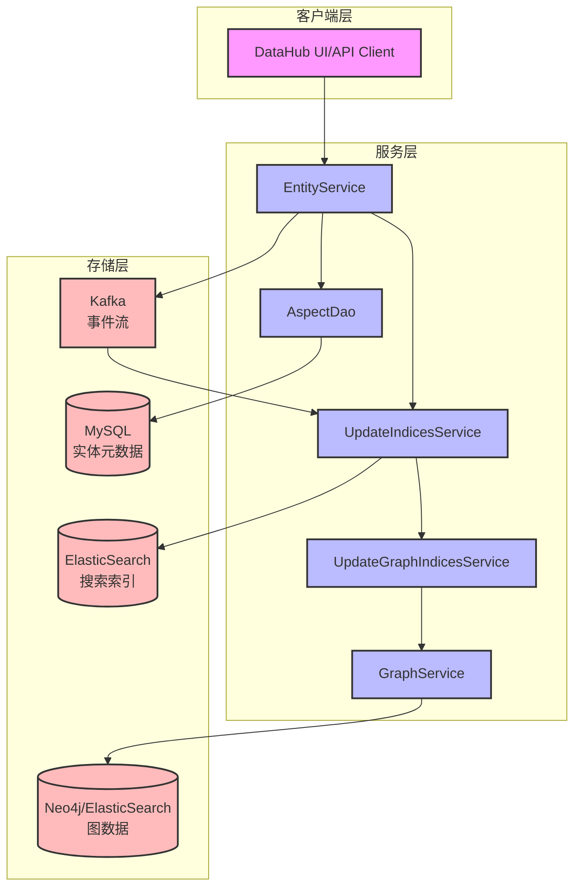
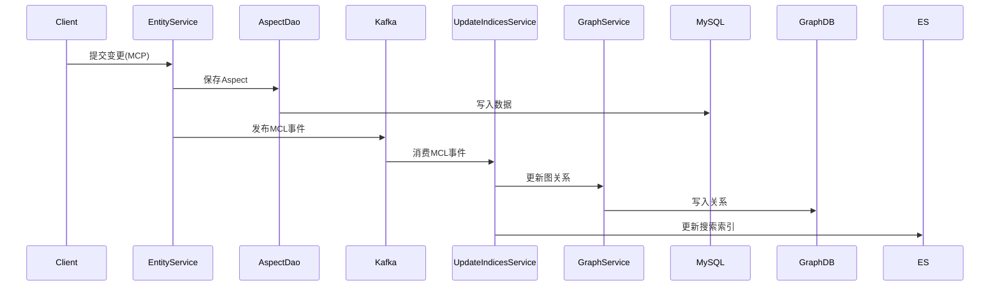

# DataHub 存储架构

## 概述

DataHub 采用混合存储架构，主要包含以下几个核心存储组件：

1. **MySQL数据库** (通过Ebean ORM) - 存储实体的元数据和方面(Aspects)
2. **图数据库** (支持Neo4j和ElasticSearch) - 存储实体之间的关系
3. **ElasticSearch** - 提供搜索功能
4. **Kafka** - 事件流处理和变更通知

## 架构图

## 核心组件说明

### 1. EntityService
- **作用**: 核心实体服务，处理所有实体的CRUD操作
- **实现类**: `EntityServiceImpl`
- **主要功能**:
  - 管理实体的生命周期
  - 处理元数据变更提议(MCP - Metadata Change Proposal)
  - 生成元数据变更日志(MCL - Metadata Change Log)
  - 协调各个存储组件的更新

### 2. AspectDao (MySQL存储)
- **作用**: 负责实体方面(Aspects)的持久化
- **实现类**: `EbeanAspectDao`
- **存储内容**:
  - 实体的各个方面(Aspects)数据
  - 版本信息
  - 系统元数据
- **表结构**: 使用`metadata_aspect_v2`表存储

### 3. GraphService (图存储)
- **作用**: 管理实体之间的关系
- **实现类**: 
  - `Neo4jGraphService` - 使用Neo4j图数据库
  - `ElasticSearchGraphService` - 使用ElasticSearch
- **存储内容**:
  - 实体之间的边(Edge)关系
  - 血缘关系(Lineage)
  - 依赖关系

### 4. UpdateIndicesService
- **作用**: 协调各种索引的更新
- **功能**:
  - 更新搜索索引(ElasticSearch)
  - 触发图索引更新
  - 处理时序数据
  - 更新系统元数据

### 5. UpdateGraphIndicesService
- **作用**: 专门处理图索引的更新
- **功能**:
  - 解析实体关系
  - 更新图数据库
  - 处理细粒度血缘关系

## 数据流程

## 存储选择策略

### MySQL存储
- 存储所有实体的核心元数据
- 支持事务和ACID特性
- 适合结构化数据存储

### 图数据库存储
- 存储实体间的关系和血缘
- 支持复杂的图查询
- 优化关系遍历性能

### ElasticSearch存储
- 提供全文搜索能力
- 存储搜索索引和部分图数据
- 支持聚合和分析查询

## 关键特性

1. **多存储协同**: 不同类型的数据存储在最适合的存储引擎中
2. **事件驱动更新**: 通过Kafka实现异步更新，保证最终一致性
3. **灵活的图存储**: 支持Neo4j和ElasticSearch两种图存储实现
4. **版本控制**: 支持Aspect的版本管理
5. **事务支持**: MySQL层面提供事务保证