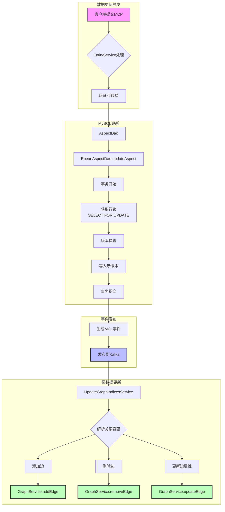

# DataHub 数据插入和更新机制

## 概述

DataHub 中的数据插入和更新采用事件驱动的架构，通过元数据变更提议(MCP)和元数据变更日志(MCL)来实现数据的一致性更新。

## 数据更新流程



## MySQL数据库插入和更新

### 1. 数据模型

MySQL中主要使用`metadata_aspect_v2`表存储实体的方面数据：

```sql
-- 简化的表结构
CREATE TABLE metadata_aspect_v2 (
    urn VARCHAR(500) NOT NULL,        -- 实体URN
    aspect VARCHAR(200) NOT NULL,      -- 方面名称
    version BIGINT NOT NULL,           -- 版本号
    metadata LONGTEXT NOT NULL,        -- JSON格式的方面数据
    systemmetadata LONGTEXT,           -- 系统元数据
    createdon DATETIME NOT NULL,       -- 创建时间
    createdby VARCHAR(255) NOT NULL,   -- 创建者
    PRIMARY KEY (urn, aspect, version)
);
```

### 2. 插入操作

```java
// EbeanAspectDao.insertAspect 核心逻辑
public Optional<EntityAspect> insertAspect(
    TransactionContext txContext, 
    SystemAspect aspect, 
    long version) {
    
    // 1. 转换为Ebean实体
    EbeanAspectV2 ebeanAspectV2 = EbeanAspectV2.fromEntityAspect(aspect.asLatest());
    
    // 2. 设置版本
    ebeanAspectV2.setVersion(version);
    
    // 3. 保存到数据库
    saveEbeanAspect(txContext, ebeanAspectV2, true);
    
    return Optional.of(ebeanAspectV2.toEntityAspect());
}
```

### 3. 更新操作

```java
// EbeanAspectDao.updateAspect 核心逻辑
public Optional<EntityAspect> updateAspect(
    TransactionContext txContext, 
    SystemAspect aspect) {
    
    // 1. 使用乐观锁机制
    EbeanAspectV2 ebeanAspectV2 = EbeanAspectV2.fromEntityAspect(aspect.asLatest());
    
    // 2. 保存更新
    saveEbeanAspect(txContext, ebeanAspectV2, false);
    
    return Optional.of(ebeanAspectV2.toEntityAspect());
}
```

### 4. 事务处理

DataHub使用READ_COMMITTED隔离级别配合行锁来保证数据一致性：

```java
// 事务配置
public static final TxIsolation TX_ISOLATION = TxIsolation.READ_COMMITED;

// 获取行锁
Query<EbeanAspectV2> query = server.find(EbeanAspectV2.class)
    .where()
    .eq("urn", urn)
    .eq("aspect", aspectName)
    .eq("version", ASPECT_LATEST_VERSION)
    .forUpdate();  // SELECT FOR UPDATE
```

## 图数据插入和更新

### 1. Neo4j图数据更新

```java
// Neo4jGraphService.addEdge 核心逻辑
public void addEdge(Edge edge) {
    // 1. 构建Cypher查询
    String query = 
        "MERGE (source:" + sourceType + " {urn: $sourceUrn}) " +
        "MERGE (destination:" + destType + " {urn: $destUrn}) " +
        "MERGE (source)-[:" + relationshipType + "]->(destination)";
    
    // 2. 设置边属性
    Map<String, Object> params = new HashMap<>();
    params.put("sourceUrn", edge.getSource().toString());
    params.put("destUrn", edge.getDestination().toString());
    params.put("createdOn", edge.getCreatedOn());
    params.put("createdActor", edge.getCreatedActor());
    
    // 3. 执行查询
    session.run(query, params);
}
```

### 2. ElasticSearch图数据更新

```java
// ElasticSearchGraphService 更新逻辑
public void addEdge(Edge edge) {
    // 1. 创建边文档
    Map<String, Object> document = buildEdgeDocument(edge);
    
    // 2. 索引到ElasticSearch
    String docId = hashEdgeId(edge);
    indexRequest = new IndexRequest(indexName)
        .id(docId)
        .source(document);
    
    // 3. 执行索引操作
    client.index(indexRequest);
}
```

## 关系更新触发场景

### 1. UpstreamLineage更新
当数据集的上游血缘关系发生变化时：

```java
// UpdateGraphIndicesService 处理血缘更新
if (aspectSpec.getName().equals(UPSTREAM_LINEAGE_ASPECT_NAME)) {
    UpstreamLineage upstreamLineage = (UpstreamLineage) aspect;
    
    // 处理每个上游关系
    for (Upstream upstream : upstreamLineage.getUpstreams()) {
        Edge edge = new Edge(
            upstream.getDataset(),  // 源节点
            urn,                    // 目标节点
            DOWNSTREAM_OF,          // 关系类型
            upstream.getCreated(),
            upstream.getActor()
        );
        graphService.addEdge(edge);
    }
}
```

### 2. DataJobInputOutput更新
当数据作业的输入输出关系变化时：

```java
// 处理数据作业的输入输出
DataJobInputOutput inputOutput = (DataJobInputOutput) aspect;

// 添加输入边
for (Urn input : inputOutput.getInputDatasets()) {
    graphService.addEdge(new Edge(input, urn, "Consumes", ...));
}

// 添加输出边  
for (Urn output : inputOutput.getOutputDatasets()) {
    graphService.addEdge(new Edge(urn, output, "Produces", ...));
}
```

## 差异化更新模式

DataHub支持两种图更新模式：

### 1. 全量更新模式
- 删除所有旧关系
- 重新添加新关系
- 适用于关系变化较大的场景

### 2. 差异更新模式(graphDiffMode)
- 比较新旧关系
- 只更新发生变化的边
- 减少不必要的图操作

```java
// 差异更新逻辑
if (graphDiffMode) {
    Set<Edge> oldEdges = extractEdges(previousAspect);
    Set<Edge> newEdges = extractEdges(aspect);
    
    // 需要删除的边
    Set<Edge> edgesToRemove = Sets.difference(oldEdges, newEdges);
    
    // 需要添加的边
    Set<Edge> edgesToAdd = Sets.difference(newEdges, oldEdges);
    
    // 执行更新
    edgesToRemove.forEach(graphService::removeEdge);
    edgesToAdd.forEach(graphService::addEdge);
}
```

## 性能优化

### 1. 批量操作
- MySQL: 使用批量插入减少数据库交互
- Neo4j: 使用批量事务提高性能

### 2. 异步处理
- 通过Kafka实现异步更新
- 避免阻塞主要业务流程

### 3. 缓存机制
- 缓存常用的实体和关系
- 减少数据库查询

### 4. 索引优化
- MySQL: 在urn、aspect、version上建立复合索引
- Neo4j: 在urn属性上创建索引加速查找
