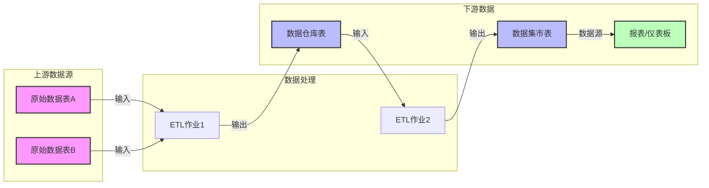
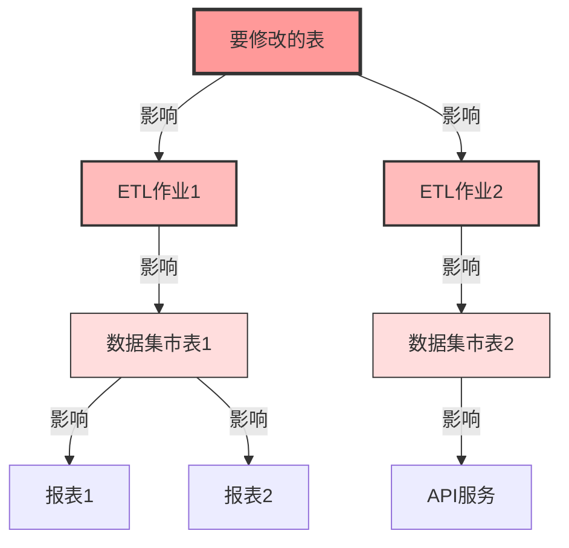
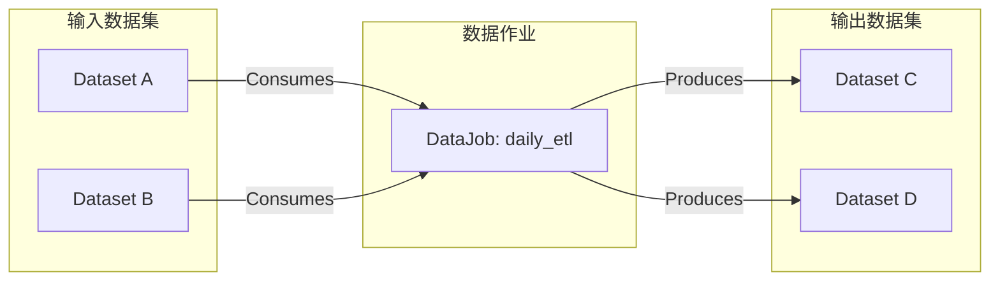
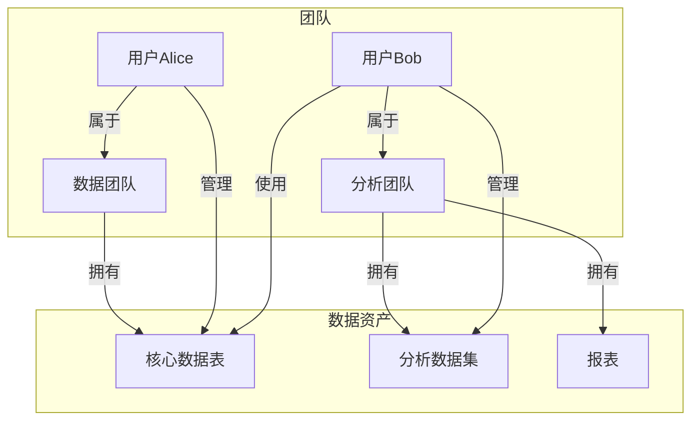
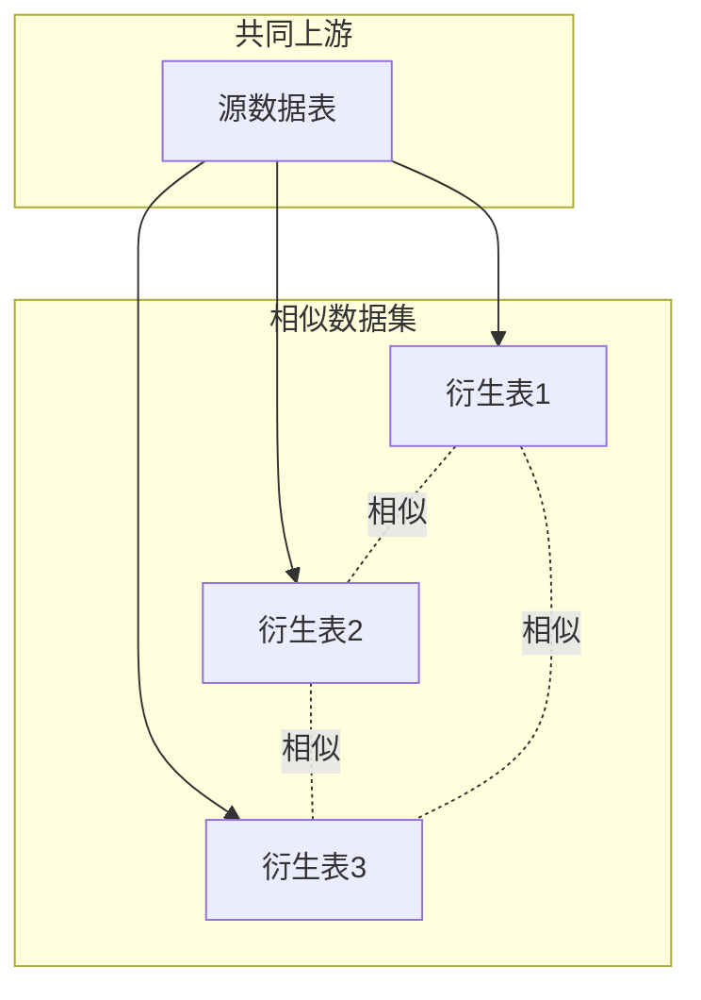

# DataHub 图数据使用场景

## 概述

DataHub 使用图数据库来存储和查询实体之间的关系。图数据在DataHub中扮演着核心角色，主要用于表示和查询数据资产之间的复杂关系网络。

## 主要使用场景

### 1. 数据血缘(Data Lineage)

数据血缘是图数据最重要的应用场景，用于追踪数据的来源、转换和去向。



#### 血缘查询示例

```java
// GraphService 血缘查询接口
public EntityLineageResult getLineage(
    Urn entityUrn,
    LineageDirection direction,  // UPSTREAM 或 DOWNSTREAM
    int maxDepth,
    int maxHops
) {
    // Neo4j Cypher查询示例
    String query = direction == LineageDirection.UPSTREAM ?
        "MATCH path=(start:Dataset {urn: $urn})<-[:DownstreamOf*1.." + maxHops + "]-(upstream) " +
        "RETURN path" :
        "MATCH path=(start:Dataset {urn: $urn})-[:DownstreamOf*1.." + maxHops + "]->(downstream) " +
        "RETURN path";
}
```

### 2. 影响分析(Impact Analysis)

当需要修改或删除某个数据资产时，通过图查询可以快速了解会影响哪些下游系统。



### 3. 数据依赖关系

#### 3.1 表与字段级别的依赖

```java
// 细粒度血缘关系
FineGrainedLineage fineGrainedLineage = new FineGrainedLineage();
// 字段级别的血缘：tableA.column1 -> tableB.column2
fineGrainedLineage.setUpstreams(
    new UrnArray(ImmutableList.of(
        Urn.createFromString("urn:li:schemaField:(urn:li:dataset:tableA,column1)")
    ))
);
fineGrainedLineage.setDownstreams(
    new UrnArray(ImmutableList.of(
        Urn.createFromString("urn:li:schemaField:(urn:li:dataset:tableB,column2)")
    ))
);
```

#### 3.2 数据作业的输入输出关系



### 4. 数据所有权和团队协作

图数据用于表示数据资产的所有权关系和团队协作网络。



### 5. 数据质量传播

通过图关系追踪数据质量问题的传播路径。

```java
// 查找受数据质量问题影响的下游资产
public Set<Urn> findAffectedDownstreams(Urn problematicDataset) {
    // 使用图查询找出所有下游依赖
    EntityLineageResult lineageResult = graphService.getLineage(
        problematicDataset,
        LineageDirection.DOWNSTREAM,
        Integer.MAX_VALUE,
        1000
    );
    
    // 返回所有可能受影响的下游资产
    return extractUrns(lineageResult);
}
```

### 6. 相似数据发现

基于图结构发现相似或相关的数据资产。



### 7. 访问路径分析

分析用户如何通过不同路径访问数据。

```java
// 查找两个实体之间的所有路径
public List<Path> findPaths(Urn source, Urn target, int maxLength) {
    String query = 
        "MATCH path = shortestPath((source {urn: $sourceUrn})-[*.."+maxLength+"]-(target {urn: $targetUrn})) " +
        "RETURN path";
    
    // 执行查询并返回路径
    return executeCypherQuery(query, source, target);
}
```

## 图数据的优势

### 1. 性能优势
- **快速遍历**: O(1)时间复杂度的关系遍历
- **深度查询**: 支持多跳查询而不影响性能
- **模式匹配**: 高效的图模式匹配

### 2. 灵活性
- **动态模式**: 无需预定义固定的关系模式
- **复杂关系**: 轻松表示多对多关系
- **属性丰富**: 节点和边都可以有属性

### 3. 直观性
- **可视化**: 图结构天然适合可视化展示
- **易理解**: 关系网络直观易懂

## 实现细节

### Neo4j实现
```cypher
// 创建索引加速查询
CREATE INDEX ON :Dataset(urn);
CREATE INDEX ON :DataJob(urn);
CREATE INDEX ON :Dashboard(urn);

// 血缘关系查询
MATCH path = (start:Dataset {urn: $urn})-[:DownstreamOf*1..3]->(end)
WHERE end:Dataset OR end:Dashboard
RETURN path;
```

### ElasticSearch实现
```json
{
  "query": {
    "bool": {
      "must": [
        { "term": { "relationshipType": "DownstreamOf" } },
        { "term": { "source.urn": "urn:li:dataset:example" } }
      ]
    }
  }
}
```

## 最佳实践

1. **合理设置查询深度**: 避免无限深度查询
2. **使用索引**: 在关键属性上创建索引
3. **批量操作**: 批量更新关系以提高性能
4. **缓存策略**: 缓存常用的血缘查询结果
5. **异步更新**: 使用事件驱动方式异步更新图数据