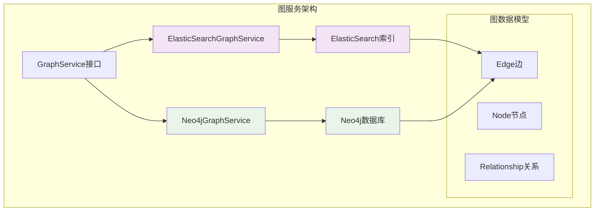
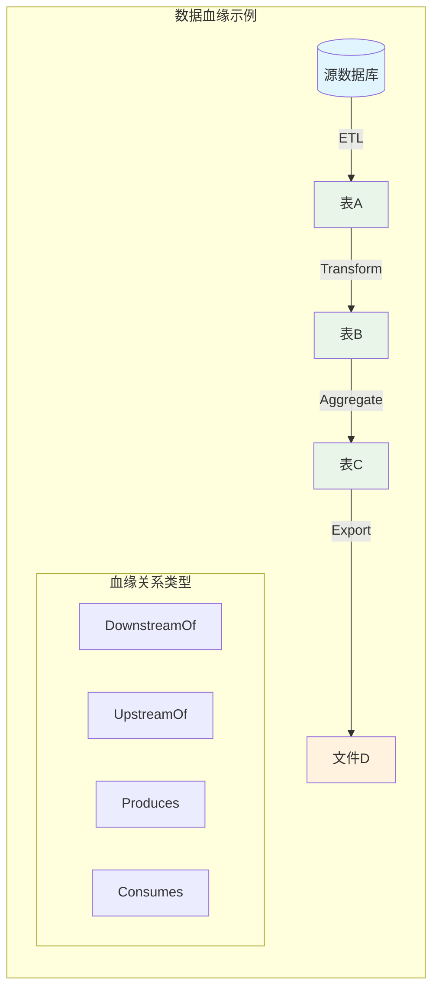
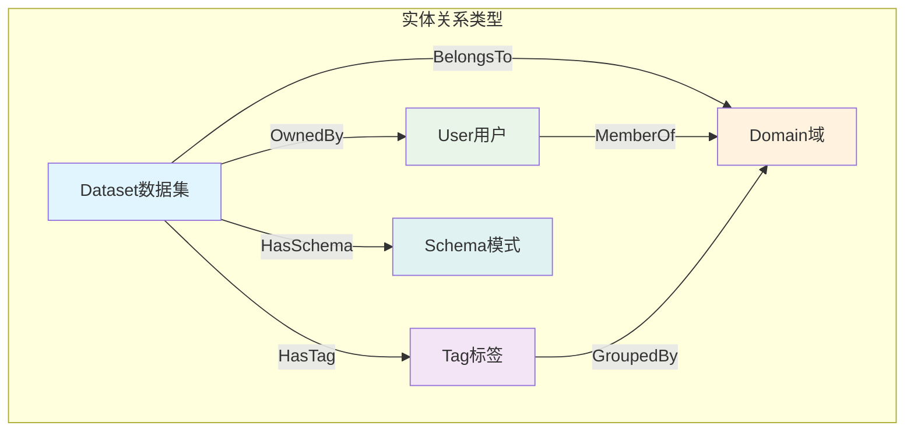
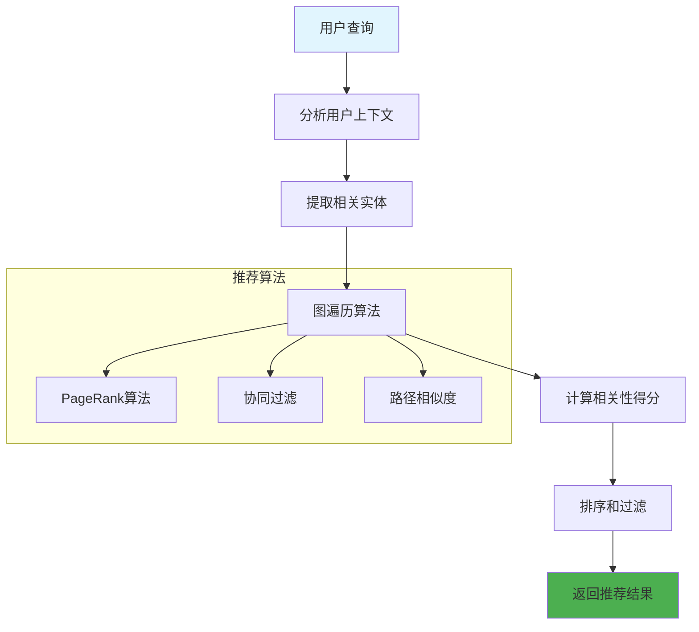
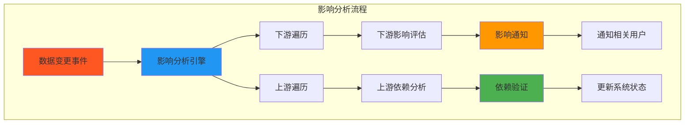
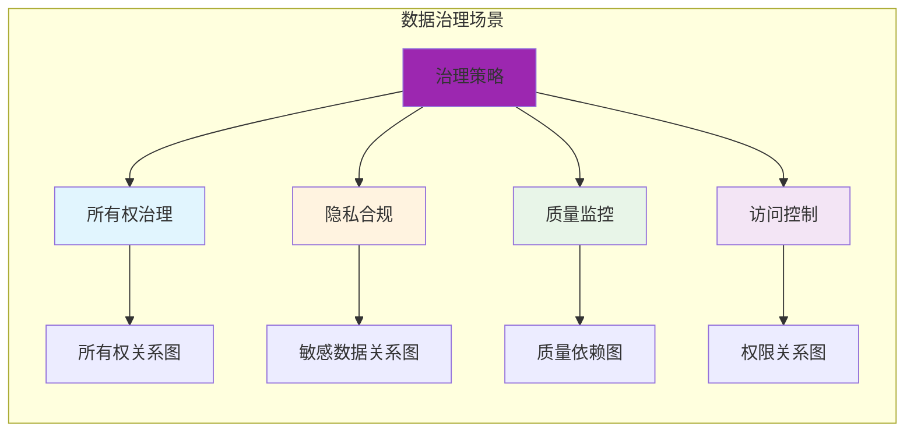
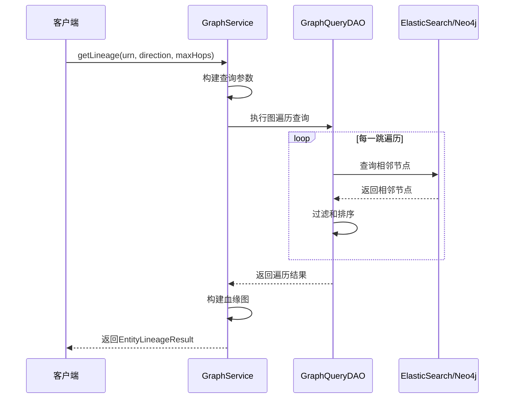
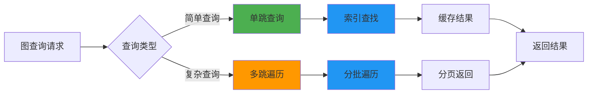
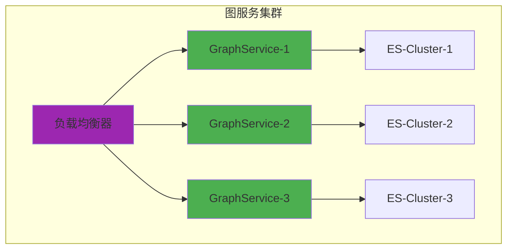

# DataHub 图数据使用场景分析

## 概述

DataHub使用图数据库技术来存储和查询实体之间的复杂关系。图数据结构非常适合表示和查询网络化的关系，如数据血缘、实体依赖、继承关系等。本文档详细分析DataHub中图数据的使用场景和实现方式。

## 图数据存储架构

### 支持的图数据库后端

DataHub提供两种图数据存储实现：



## 核心使用场景

### 1. 数据血缘（Data Lineage）

**场景描述**：追踪数据在不同系统间的流转路径，了解数据的来源和去向。



**实现机制**：
```java
// 添加血缘关系
public void addLineageEdge(Urn source, Urn destination, String relationshipType) {
    Edge edge = Edge.builder()
        .source(source)
        .destination(destination)
        .relationshipType(relationshipType)  // "DownstreamOf", "UpstreamOf"
        .build();
    graphService.addEdge(edge);
}

// 查询血缘关系
public EntityLineageResult getLineage(Urn entityUrn, LineageDirection direction, int maxHops) {
    return graphService.getLineage(
        operationContext, 
        entityUrn, 
        direction,    // UPSTREAM, DOWNSTREAM, BOTH
        0,           // offset
        1000,        // count
        maxHops      // 遍历深度
    );
}
```

**血缘查询类型**：

1. **上游血缘**：查找数据的来源
2. **下游血缘**：查找数据的去向
3. **影响分析**：评估数据变更的影响范围
4. **根因分析**：追踪数据问题的源头

### 2. 实体关系查询

**场景描述**：查询实体之间的各种关系，如所有权、标签、组织结构等。



**关系类型及用途**：

| 关系类型 | 源实体 | 目标实体 | 使用场景 |
|---------|-------|---------|---------|
| `OwnedBy` | Dataset | User | 数据所有权管理 |
| `HasTag` | Dataset | Tag | 数据分类和发现 |
| `BelongsTo` | Dataset | Domain | 数据域管理 |
| `HasSchema` | Dataset | Schema | 数据结构管理 |
| `MemberOf` | User | Group | 用户组织管理 |
| `DeprecatedBy` | Dataset | Dataset | 数据版本管理 |

### 3. 数据发现和推荐

**场景描述**：基于图关系进行智能数据发现和推荐。



**推荐场景**：

1. **相似数据集推荐**：基于标签、模式、血缘关系
2. **相关用户推荐**：基于共同访问的数据
3. **标签推荐**：基于数据内容和现有标签
4. **领域推荐**：基于数据特征和组织结构

### 4. 影响分析（Impact Analysis）

**场景描述**：分析某个数据变更对整个数据生态系统的影响。



**分析维度**：

1. **直接影响**：一跳关系内的实体
2. **间接影响**：多跳关系内的实体
3. **影响程度**：基于关系权重和类型
4. **时间窗口**：预估影响传播时间

### 5. 数据治理和合规

**场景描述**：基于图关系进行数据治理策略的实施和监控。



**治理用例**：

1. **数据所有权验证**：确保每个数据集都有明确的所有者
2. **敏感数据追踪**：追踪包含PII数据的所有下游数据集
3. **访问权限审计**：分析用户对数据的访问路径
4. **合规性检查**：验证数据处理是否符合法规要求

## 图查询操作详解

### 1. 基础图操作

```java
// 添加边
public void addEdge(Edge edge) {
    String docId = edge.toDocId(idHashAlgo);
    String edgeDocument = toDocument(edge);
    graphWriteDAO.upsertDocument(docId, edgeDocument);
}

// 删除边
public void removeEdge(Edge edge) {
    String docId = edge.toDocId(idHashAlgo);
    graphWriteDAO.deleteDocument(docId);
}

// 查找相关实体
public RelatedEntitiesResult findRelatedEntities(
    OperationContext opContext,
    GraphFilters graphFilters,
    int offset,
    Integer count) {
    
    SearchResponse response = graphReadDAO.getSearchResponse(
        opContext, graphFilters, offset, count);
    return parseSearchResponse(response);
}
```

### 2. 复杂图遍历



### 3. 图查询优化

**ElasticSearch图查询优化**：
```json
{
  "query": {
    "bool": {
      "must": [
        {"term": {"source.urn": "urn:li:dataset:(...)"}},
        {"terms": {"relationshipType": ["DownstreamOf", "Produces"]}}
      ]
    }
  },
  "sort": [
    {"createdOn": {"order": "desc"}}
  ],
  "size": 1000
}
```

**Neo4j图查询优化**：
```cypher
// 高效的血缘查询
MATCH path = (source)-[:DownstreamOf*1..3]->(target)
WHERE source.urn = $sourceUrn
RETURN path, length(path) as depth
ORDER BY depth
LIMIT 1000
```

## 性能考虑和优化策略

### 1. 查询性能优化



**优化策略**：

1. **查询限制**：
   - 限制遍历深度（通常≤5跳）
   - 限制返回结果数量
   - 设置查询超时时间

2. **索引优化**：
   - 为常用查询路径建立索引
   - 使用复合索引提升查询效率
   - 定期维护索引性能

3. **缓存策略**：
   - 缓存热点查询结果
   - 使用分布式缓存减少数据库压力
   - 智能缓存失效策略

### 2. 存储优化

```yaml
# ElasticSearch图索引配置
graph_service_v1:
  settings:
    number_of_shards: 5
    number_of_replicas: 1
    index.mapping.total_fields.limit: 2000
  mappings:
    properties:
      source.urn:
        type: keyword
        index: true
      destination.urn:
        type: keyword
        index: true
      relationshipType:
        type: keyword
        index: true
      createdOn:
        type: date
        index: true
```

## 监控和运维

### 1. 关键指标监控

```mermaid
dashboard TB
    subgraph "图服务监控指标"
        QPS[查询QPS]
        Latency[查询延迟]
        ErrorRate[错误率]
        CacheHit[缓存命中率]
        
        GraphSize[图规模]
        EdgeCount[边数量]
        NodeCount[节点数量]
        TraversalDepth[平均遍历深度]
    end
    
    style QPS fill:#4caf50
    style Latency fill:#ff9800
    style ErrorRate fill:#f44336
    style CacheHit fill:#2196f3
```

### 2. 常见运维操作

1. **图数据重建**：
   ```java
   // 重建图索引
   public void rebuildGraphIndex() {
       graphService.clear();
       // 从MySQL重新加载所有关系数据
       reprocessAllRelationships();
   }
   ```

2. **图一致性检查**：
   ```java
   // 检查图数据一致性
   public void validateGraphConsistency() {
       // 验证孤立节点
       // 验证双向关系一致性
       // 验证关系类型正确性
   }
   ```

## 扩展性考虑

### 1. 水平扩展



### 2. 数据分片策略

1. **按实体类型分片**：将不同类型的实体分配到不同分片
2. **按关系类型分片**：将不同类型的关系分配到不同分片
3. **按时间分片**：将不同时间段的数据分配到不同分片

## 最佳实践

### 1. 图设计原则

1. **关系明确性**：每种关系类型都应有明确的语义
2. **避免过度连接**：控制单个节点的连接数量
3. **权重管理**：为重要关系设置适当权重
4. **生命周期管理**：及时清理过期关系

### 2. 查询优化建议

1. **使用过滤器**：在查询中尽早应用过滤条件
2. **限制深度**：合理设置遍历深度限制
3. **批量查询**：将多个小查询合并为批量查询
4. **异步处理**：对复杂查询使用异步处理机制

## 总结

DataHub的图数据使用场景主要集中在以下几个方面：

1. **数据血缘追踪**：核心功能，支持上下游关系查询
2. **实体关系管理**：所有权、标签、域等关系管理
3. **智能推荐**：基于图算法的数据发现和推荐
4. **影响分析**：数据变更影响评估和传播分析
5. **治理和合规**：基于关系的数据治理策略实施

通过合理的图设计和优化策略，DataHub能够高效地处理复杂的关系查询需求，为数据治理和发现提供强大的支持。