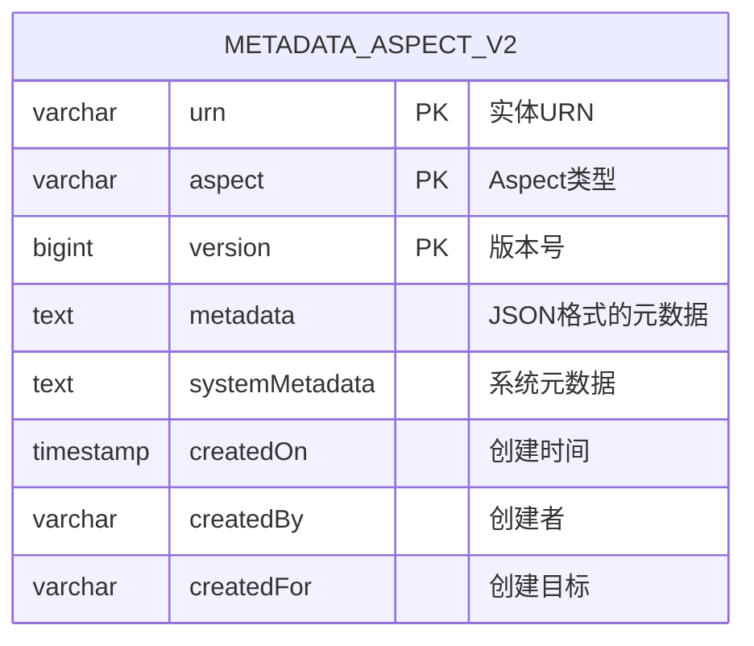
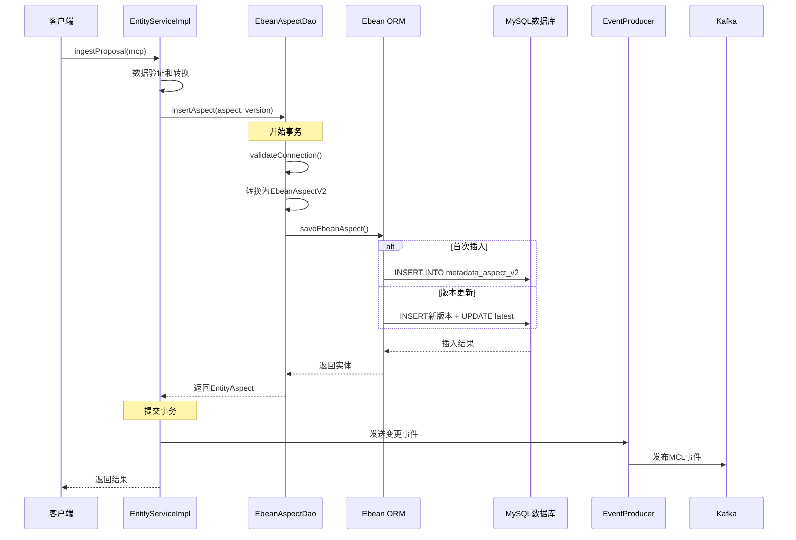
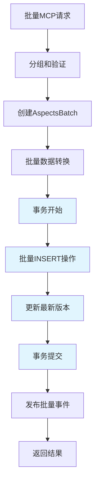
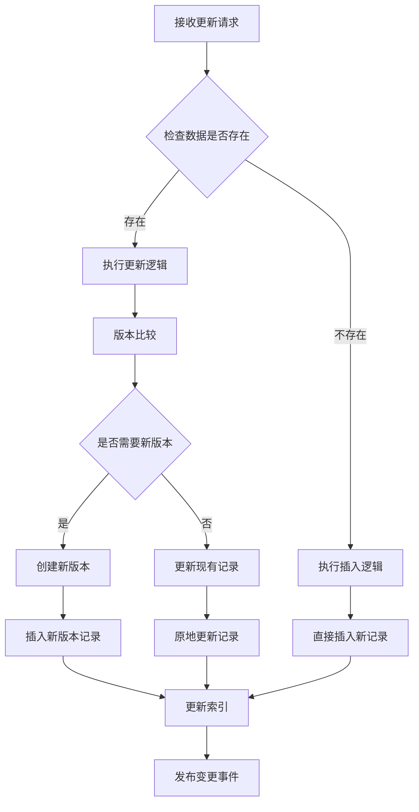
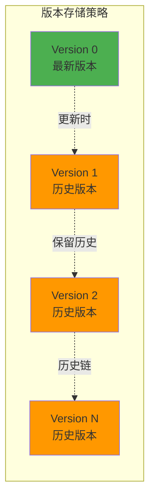
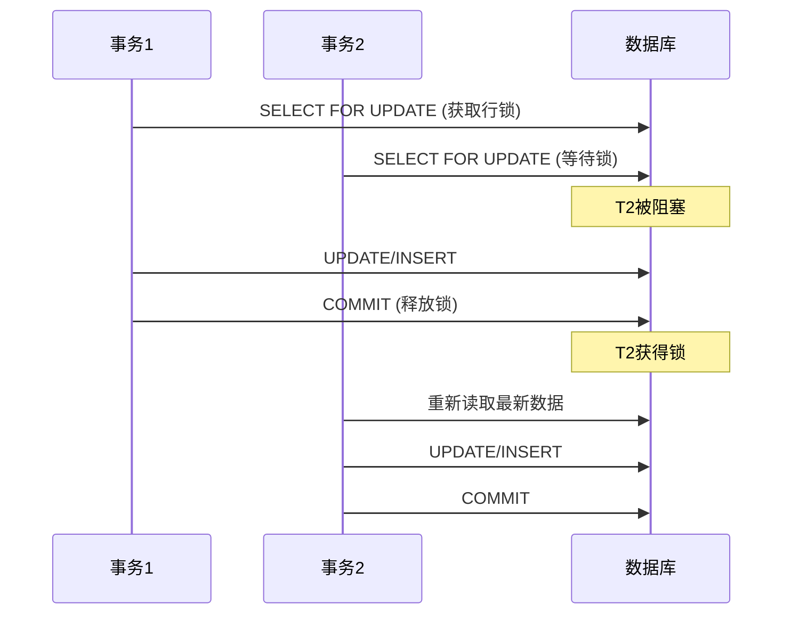
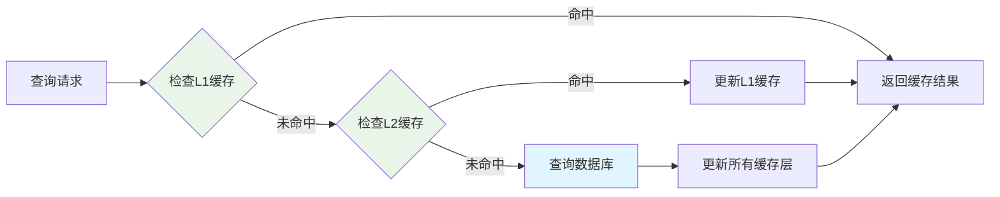
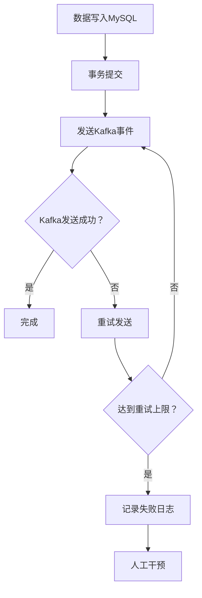

# DataHub MySQL 数据库操作详解

## 概述

DataHub使用MySQL作为主要的元数据存储后端，通过Ebean ORM框架实现对MySQL的数据访问。本文档详细分析DataHub中MySQL数据库的插入和更新操作机制。

## 核心组件

### 1. EbeanAspectDao - 数据访问层

`EbeanAspectDao` 是DataHub访问MySQL的核心DAO组件，实现了：
- **Aspect存储**：元数据的增删改查
- **版本控制**：支持多版本数据存储
- **批量操作**：高效的批量数据处理
- **事务管理**：ACID事务保证

### 2. 数据模型

DataHub使用统一的Aspect模型存储所有元数据：



**关键字段说明**：
- `urn`: 实体的唯一标识符
- `aspect`: 元数据类型（如 DatasetProperties, SchemaMetadata）
- `version`: 版本号，0表示最新版本
- `metadata`: JSON格式存储的业务元数据
- `systemMetadata`: 系统级元数据（审计信息等）

## 插入操作流程

### 1. 单个Aspect插入



**关键代码流程**：

1. **数据验证**：
```java
// EntityServiceImpl.applyUpsert()
static SystemAspect applyUpsert(ChangeMCP changeMCP, SystemAspect latestAspect) {
    long rowNextVersion = Math.max(1, changeMCP.getNextAspectVersion());
    // 版本控制和审计信息设置
    SystemMetadata changeSystemMetadata = new SystemMetadata(changeMCP.getSystemMetadata().copy().data());
    changeSystemMetadata.setVersion(String.valueOf(rowNextVersion));
}
```

2. **数据库插入**：
```java
// EbeanAspectDao.insertAspect()
public Optional<EntityAspect> insertAspect(TransactionContext txContext, SystemAspect aspect, long version) {
    validateConnection();
    if (!canWrite) return Optional.empty();
    
    EbeanAspectV2 ebeanAspectV2 = EbeanAspectV2.fromEntityAspect(aspect.asLatest());
    saveEbeanAspect(txContext, ebeanAspectV2, true);
    return Optional.of(ebeanAspectV2.toEntityAspect());
}
```

### 2. 批量插入操作



**批量操作优化**：
- 使用JDBC批处理减少网络往返
- 智能分批，避免内存溢出
- 优化SQL生成，减少数据库负载

## 更新操作流程

### 1. Upsert操作（插入或更新）

DataHub采用Upsert模式，根据数据是否存在自动选择插入或更新：



### 2. 版本控制机制

DataHub实现了sophisticated的版本控制：



**版本控制规则**：
- **Version 0**：始终表示最新版本
- **Version > 0**：表示历史版本
- 更新时创建新的历史版本，然后更新version 0
- 支持版本回滚和历史查询

## 事务管理

### 1. 事务隔离级别

DataHub使用`READ_COMMITTED`隔离级别，配合`SELECT FOR UPDATE`实现乐观锁：

```java
public static final TxIsolation TX_ISOLATION = TxIsolation.READ_COMMITED;
```

### 2. 并发控制



### 3. 重试机制

```java
private static final int DEFAULT_MAX_TRANSACTION_RETRY = 3;

// 自动重试事务冲突
public TransactionResult<IngestResult> ingestAspects(/* ... */) {
    for (int retry = 0; retry < maxRetries; retry++) {
        try {
            return executeTransaction(/* ... */);
        } catch (OptimisticLockException e) {
            if (retry == maxRetries - 1) throw e;
            // 指数退避重试
            Thread.sleep((1L << retry) * 100);
        }
    }
}
```

## 查询操作优化

### 1. 批量查询

DataHub实现了智能的批量查询机制：

```java
// 自动分批查询，避免SQL参数过多
private int queryKeysCount = 375; // 单次查询最大key数量

public Map<EntityAspectIdentifier, EntityAspect> batchGet(Set<EntityAspectIdentifier> keys) {
    if (queryKeysCount <= 0) {
        return batchGetIn(keys); // 单次查询
    } else {
        return batchGetPaginated(keys, queryKeysCount); // 分页查询
    }
}
```

### 2. SQL优化

**复合主键查询优化**：
```sql
-- 优化前：多个单独查询
SELECT * FROM metadata_aspect_v2 WHERE urn = ? AND aspect = ? AND version = ?

-- 优化后：复合IN查询
SELECT * FROM metadata_aspect_v2 
WHERE (urn, aspect, version) IN (
    ('urn1', 'aspect1', 0),
    ('urn2', 'aspect2', 0),
    ('urn3', 'aspect3', 1)
)
```

### 3. 缓存策略



## 性能监控和指标

### 1. 关键性能指标

DataHub集成了全面的性能监控：

```java
// 数据库操作耗时
MetricUtils.timer(MetricRegistry.TIMER_ASPECT_GET_TIME)
    .time(() -> executeQuery());

// 批量操作大小
MetricUtils.histogram(BATCH_SIZE_ATTR, batchSize);

// 错误率监控  
MetricUtils.counter(ASPECT_DAO_ERROR_COUNTER)
    .increment();
```

### 2. 监控维度

- **操作类型**：INSERT, UPDATE, SELECT, DELETE
- **批量大小**：单次操作的记录数量
- **响应时间**：数据库操作耗时分布
- **错误率**：失败操作的比例
- **并发度**：同时进行的数据库连接数

## 数据库优化建议

### 1. 索引策略

```sql
-- 主键索引（自动创建）
PRIMARY KEY (urn, aspect, version)

-- 查询优化索引
CREATE INDEX idx_metadata_aspect_v2_urn_aspect 
ON metadata_aspect_v2 (urn, aspect);

-- 时间范围查询索引
CREATE INDEX idx_metadata_aspect_v2_created_on 
ON metadata_aspect_v2 (createdOn);
```

### 2. 分区策略

```sql
-- 按时间分区（针对大量历史数据）
CREATE TABLE metadata_aspect_v2 (
    -- 字段定义
) PARTITION BY RANGE (YEAR(createdOn)) (
    PARTITION p2023 VALUES LESS THAN (2024),
    PARTITION p2024 VALUES LESS THAN (2025),
    PARTITION p_future VALUES LESS THAN MAXVALUE
);
```

### 3. 连接池优化

```yaml
# 数据库连接池配置
ebean:
  datasource:
    maximumPoolSize: 20
    minimumIdle: 5
    connectionTimeout: 30000
    idleTimeout: 600000
    maxLifetime: 1800000
```

## 故障处理和恢复

### 1. 常见故障场景

1. **死锁检测**：
   - 自动重试机制
   - 指数退避策略
   - 最大重试次数限制

2. **连接池耗尽**：
   - 连接泄漏检测
   - 自动连接回收
   - 监控告警

3. **大事务超时**：
   - 批量操作分片
   - 事务超时配置
   - 异步处理

### 2. 数据一致性保证



## 总结

DataHub的MySQL操作设计体现了以下特点：

1. **高性能**：批量操作、连接池、缓存优化
2. **高可靠**：ACID事务、重试机制、故障恢复
3. **可扩展**：分片策略、异步处理、监控告警
4. **易维护**：清晰的分层架构、完善的日志记录

这种设计确保了DataHub能够高效、可靠地处理大规模元数据的存储和查询需求。