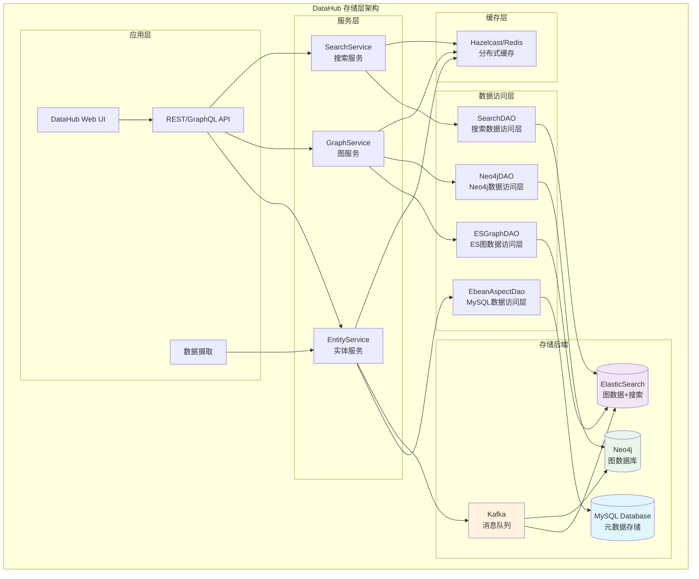
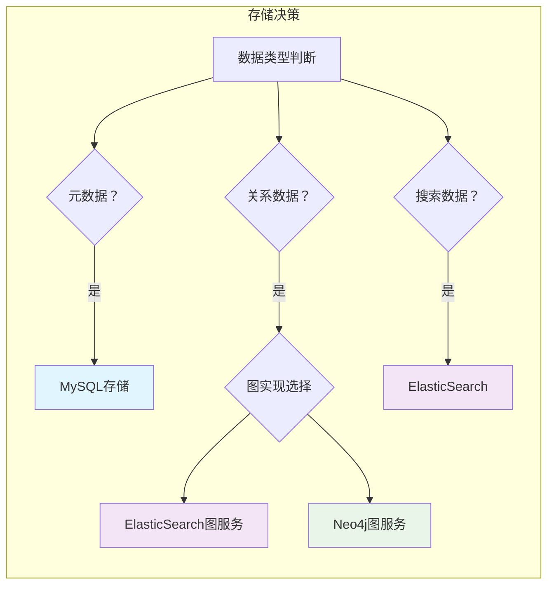
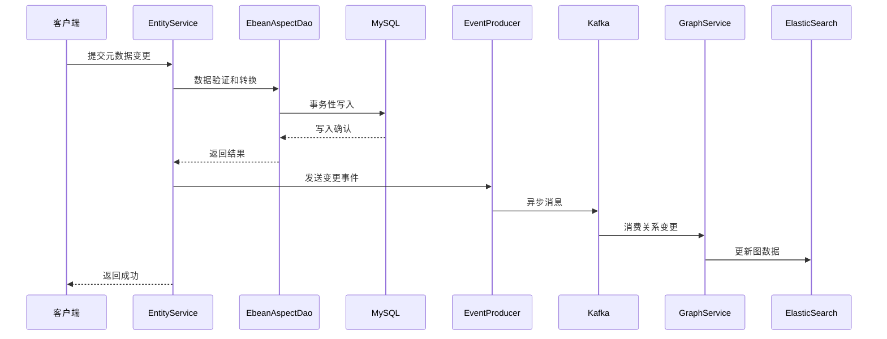
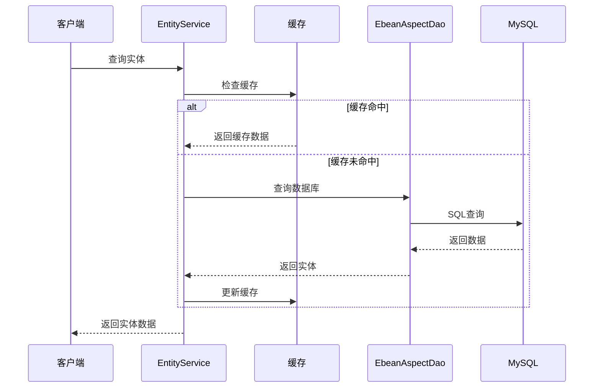

# DataHub 存储架构分析

## 概述

DataHub 是一个现代化的数据发现和治理平台，其存储架构采用了多层次、多后端的设计模式。系统主要使用两种类型的存储后端来满足不同的数据访问需求：

1. **关系型数据库（MySQL）** - 用于存储元数据的结构化数据
2. **图数据库（ElasticSearch/Neo4j）** - 用于存储和查询实体间的关系数据
3. **搜索引擎（ElasticSearch）** - 用于全文搜索和复杂查询

## 整体存储架构



## 核心组件详解

### 1. EntityService - 实体服务

`EntityServiceImpl` 是DataHub的核心服务，负责：

- **实体生命周期管理**：创建、更新、删除实体
- **版本控制**：管理实体的多版本存储
- **批量操作**：支持高效的批量数据处理
- **事务管理**：确保数据一致性
- **事件发布**：向Kafka发送变更事件

**关键特性**：
- 使用 `EbeanAspectDao` 访问MySQL
- 支持乐观锁并发控制
- 实现了完整的ACID事务
- 集成缓存机制提升性能

### 2. GraphService - 图服务

图服务提供两种实现：

#### ElasticSearchGraphService
- 基于ElasticSearch的图数据存储
- 适合大规模数据和复杂查询
- 支持全文搜索和聚合分析
- 默认的图服务实现

#### Neo4jGraphService  
- 基于Neo4j的原生图数据库
- 专为图遍历和关系查询优化
- 支持Cypher查询语言
- 可选的图服务实现

### 3. 存储后端选择



## 数据流转模式

### 写入流程



### 读取流程



## 关键设计特点

### 1. 分层架构
- **表现层**：Web UI和API
- **业务层**：各种服务组件
- **数据访问层**：DAO组件
- **存储层**：多种后端存储

### 2. 多存储后端
- **MySQL**：ACID事务，结构化数据
- **ElasticSearch**：搜索和图数据
- **Neo4j**：专业图数据库
- **Kafka**：异步消息处理

### 3. 异步处理
- 使用Kafka实现存储后端间的数据同步
- 分离写入和索引更新，提升性能
- 支持最终一致性模型

### 4. 扩展性设计
- 支持水平扩展
- 可插拔的存储实现
- 微服务架构支持

## 配置管理

DataHub使用Spring Boot的配置管理，通过不同的Factory类实现存储后端的选择：

- `ElasticSearchGraphServiceFactory` - ElasticSearch图服务配置
- `Neo4jGraphServiceFactory` - Neo4j图服务配置
- `EbeanAspectDaoFactory` - MySQL数据访问配置

配置示例：
```yaml
# 图服务类型选择
graphService:
  type: elasticsearch  # 或 neo4j

# MySQL配置
ebean:
  datasource:
    url: jdbc:mysql://localhost:3306/datahub
    username: datahub
    password: datahub

# ElasticSearch配置
elasticsearch:
  host: localhost
  port: 9200
```

## 总结

DataHub的存储架构通过多后端存储、分层设计和异步处理，实现了高性能、高可用和强扩展性的数据管理平台。这种架构能够有效支撑大规模元数据管理的需求，同时保持了良好的维护性和扩展性。